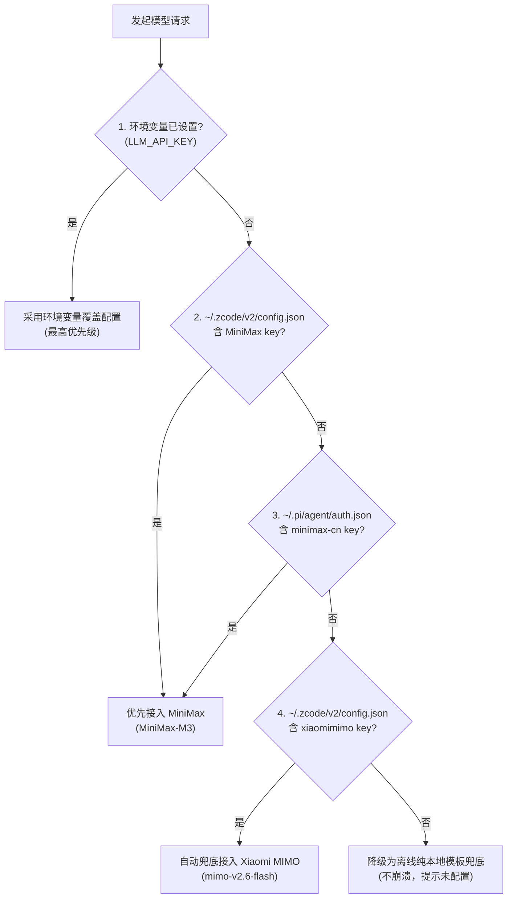
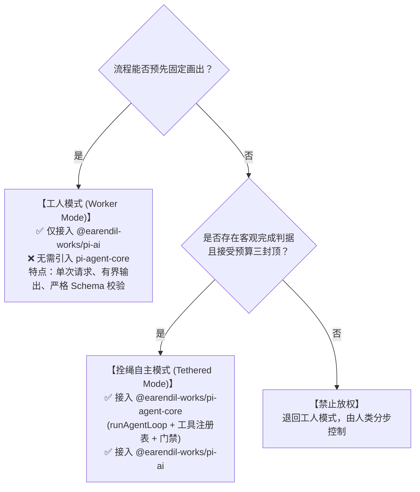

# AI Agent Runtime 接入与双轨模型凭据标准规范
### Universal AI Agent Integration & Dual-Track Credential Specification

| 元数据 | 说明 |
|---|---|
| **适用范围** | ZCode 生态所有需要接入 AI Agent / LLM 能力的产品及服务 |
| **生效状态** | **强制规范**（新产品接入、存量迭代均须严格遵循） |
| **标准参考** | `~/.zcode/standards/AGENT-RUNTIME.md` · 全局 AI Agent 产品分工原则 |
| **基线参考工程** | `data-cleaning`（数据清洗工作台）、`deep-research`（深度研究智能体） |

---

## 目录
- [一、 顶层架构与职责分工原则](#一-顶层架构与职责分工原则)
- [二、 规范项 1：模型双轨策略与凭证无感发现](#二-规范项-1模型双轨策略与凭证无感发现)
  - [2.1 模型双轨定义与选型](#21-模型双轨定义与选型)
  - [2.2 三级凭证自动发现机制（免配开箱即用）](#22-三级凭证自动发现机制免配开箱即用)
  - [2.3 密钥安全防护与隔离红线](#23-密钥安全防护与隔离红线)
  - [2.4 模型特殊协议处理（避坑实践）](#24-模型特殊协议处理避坑实践)
- [三、 规范项 2：Agent Runtime 接入标准](#三-规范项-2agent-runtime-接入标准)
  - [3.1 SDK 选型决策矩阵（pi-ai vs pi-agent-core）](#31-sdk-选型决策矩阵pi-ai-vs-pi-agent-core)
  - [3.2 架构要求 1：适配层强制隔离（Kernel Pattern）](#32-架构要求-1适配层强制隔离kernel-pattern)
  - [3.3 架构要求 2：写操作强制门禁（Side-effect Gate）](#33-架构要求-2写操作强制门禁side-effect-gate)
  - [3.4 架构要求 3：本地数据隐私围栏（0 字节出境）](#34-架构要求-3本地数据隐私围栏0-字节出境)
  - [3.5 架构要求 4：调用审计留痕（Traceability）](#35-架构要求-4调用审计留痕traceability)
- [四、 标准参考代码骨架（可直接复用）](#四-标准参考代码骨架可直接复用)
  - [4.1 Node.js / TypeScript 核心适配器（kernel.ts）](#41-nodejs--typescript-核心适配器kernelts)
  - [4.2 启动脚本环境变量自动注入（Shell / .command）](#42-启动脚本环境变量自动注入shell--command)
  - [4.3 自动化测试桩规范（SSE Stream Mocking）](#43-自动化测试桩规范sse-stream-mocking)
- [五、 新产品上线合规验收清单（Checklist）](#五-新产品上线合规验收清单checklist)

---

## 一、 顶层架构与职责分工原则

所有 AI Agent 类产品的设计与开发，必须严格遵守**职责三分**原则：

> **AI 推进流程（执行权），产品承担围栏约束（约束权），人类负责决策（决策权）。**

1. **LLM 推进流程（执行权）**：模型是有界思考与转换引擎。理解需求、生成代码/结构化建议、格式对齐由模型在约束内推进；
2. **产品 Harness 承担围栏约束（约束权）**：安全、隐私与资源配额必须是代码层的物理事实——本地数据隔离、超时熔断、参数脱敏由确定性代码强制执行，**严禁靠提示词祈求模型“别越界”**；
3. **人类负责决策（决策权）**：凡涉及改动数据、落盘写文件、产生实际副作用的操作，必须经过人类最终确认。

---

## 二、 规范项 1：模型双轨策略与凭证无感发现

### 2.1 模型双轨定义与选型
为保证产品高可用、规避单一提供商限流、欠费或网络抖动，所有产品统一接入双轨模型架构：

| 链路角色 | 提供商 (Provider) | 模型标识 (Model ID) | 接口端点 (Base URL) | 接口协议 | 特点与分工 |
|---|---|---|---|---|---|
| **首选（主用）** | `minimax-cn` | `MiniMax-M3` | `https://api.minimax.cn/v1` | `openai-completions` | 推理能力强、逻辑严密、优先承担复杂代码与建议生成 |
| **备选（兜底）** | `xiaomi-token-plan-cn` | `mimo-v2.6-flash` | `https://token-plan-cn.xiaomimimo.com/v1` | `openai-completions` | 响应极速、低延时、国内高吞吐直连，主用故障/未配时无感接管 |

### 2.2 三级凭证自动发现机制（免配开箱即用）
为实现用户无论在终端命令行、IDE 调试还是双击启动脚本均能**零配置开箱即用**，适配器必须按如下顺序自动发现凭证：



### 2.3 密钥安全防护与隔离红线
- **绝不进仓**：严禁在代码仓库、git 提交、测试夹具中硬编码任何真实 Key；
- **绝不打日志**：控制台输出、运行日志、审计报表严禁打印包含 Key 原文的字符串；
- **向外暴露最小化**：前端界面与 `/api/llm/status` 等只读接口只允许暴露 `provider`（如 `minimax-cn`）与 `host`（如 `api.minimax.cn`），隐藏全部路径与密钥。

### 2.4 模型特殊协议处理（避坑实践）
1. **MiniMax `<think>` 标签剥离**：
   MiniMax 推理模型默认会在回复前附加 `<think>...</think>` 思考过程。适配层必须在完成接收后**立刻正则剥离**，否则会破坏下游的 JSON 解析或代码正则匹配：
   ```ts
   export function stripThinkTags(raw: string): string {
     return raw.replace(/<think>[\s\S]*?<\/think>/gi, "").trim();
   }
   ```
2. **小米 Token Plan System 通道兼容**：
   实测小米 Token Plan OpenAI 端点不支持独立的 `system` 角色通道。适配层组装上下文时，统一将系统要求并入首条 `user` 提示词。

---

## 三、 规范项 2：Agent Runtime 接入标准

### 3.1 SDK 选型决策矩阵（pi-ai vs pi-agent-core）

在启动开发前，必须依据《AGENT-RUNTIME.md》§5 决策矩阵对业务形态进行定性：



- **数据清洗、结构提取、代码生成、SQL 生成等典型场景**：均属于**工人模式**，**只接入 `@earendil-works/pi-ai`** 即可，坚决避免过度工程。

### 3.2 架构要求 1：适配层强制隔离（Kernel Pattern）
业务代码（控制器、前端路由、报表模块）**零直接 import** `@earendil-works/pi-ai`。
全部 SDK 初始化、模型组装、流式监听、超时控制、异常规整均收敛在单一模块（如 `src/agent/kernel.ts`）。上游 SDK 发生破坏性变更时，改动范围只限制在适配层内。

### 3.3 架构要求 2：写操作强制门禁（Side-effect Gate）
模型生成的任何清洗逻辑、修改脚本、文件写入，**绝对禁止直接执行**：
1. **第一步（只读预览）**：代码在隔离沙箱或本地内存中只对前 10 行样本试跑；
2. **第二步（视觉呈现）**：前端弹窗呈现变更前后的对比（Diff Preview）；
3. **第三步（人工确认）**：必须由人类主动点击“确认应用”，后端方可真正写入落盘。

### 3.4 架构要求 3：本地数据隐私围栏（0 字节出境）
涉及业务数据的清洗分析时，发往外部 LLM 的上下文**仅限**：
- 字段名（列名）、数据类型（dtype）；
- 用户输入的自然语言清洗需求；
- 最多 1~2 个经过截断（≤50 字符）的安全样本值。
**全量明细数据 100% 留在本地运行计算（如本地 Python 沙箱），明细数据零外传。**

### 3.5 架构要求 4：调用审计留痕（Traceability）
适配层必须维护调用审计追踪（可存入内存环形队列或数据库）：
- 记录每次调用的时间戳、Provider、Model ID；
- 记录耗时（毫秒）、输入/输出字符量；
- 记录调用成功状态或异常错误摘要，确保可排查、可追责。

---

## 四、 标准参考代码骨架（可直接复用）

### 4.1 Node.js / TypeScript 核心适配器（kernel.ts）
以下为经过生产检验的标准适配器实现，新建产品可直接复用该模式：

```typescript
// src/agent/kernel.ts
import fs from "node:fs";
import os from "node:os";
import path from "node:path";
import { type Context, type Model, type Api } from "@earendil-works/pi-ai";

export interface AgentLlmConfig {
  baseUrl: string;
  apiKey: string;
  model: string;
  timeoutMs: number;
  provider?: string;
}

export interface AgentAuditRecord {
  id: string;
  timestamp: string;
  provider: string;
  model: string;
  durationMs: number;
  charsIn: number;
  charsOut: number;
  success: boolean;
  error?: string;
}

const auditRecords: AgentAuditRecord[] = [];
export function getAgentAuditRecords(): AgentAuditRecord[] {
  return [...auditRecords];
}

/** 本机凭证自动探测（优先 MiniMax，备选 Xiaomi MIMO） */
export function autoDiscoverLocalLlmConfig(): AgentLlmConfig | null {
  const home = os.homedir();
  const zcodePath = path.join(home, ".zcode", "v2", "config.json");

  // 1. 优先提取 MiniMax
  if (fs.existsSync(zcodePath)) {
    try {
      const cfg = JSON.parse(fs.readFileSync(zcodePath, "utf-8"));
      for (const p of Object.values(cfg.provider ?? {})) {
        const opts = (p as any)?.options;
        const base = String(opts?.baseURL || "");
        const name = String((p as any)?.name || "");
        if (base.includes("minimax") || name.toLowerCase().includes("minimax")) {
          if (opts?.apiKey?.trim()) {
            return {
              baseUrl: "https://api.minimax.cn/v1",
              apiKey: opts.apiKey.trim(),
              model: "MiniMax-M3",
              provider: "minimax-cn",
              timeoutMs: 30_000,
            };
          }
        }
      }
    } catch {}
  }

  // 1.2 备选 ~/.pi/agent/auth.json
  const piAuthPath = path.join(home, ".pi", "agent", "auth.json");
  if (fs.existsSync(piAuthPath)) {
    try {
      const auth = JSON.parse(fs.readFileSync(piAuthPath, "utf-8"));
      const mmKey = auth["minimax-cn"]?.key || auth["minimax"]?.key;
      if (mmKey?.trim()) {
        return {
          baseUrl: "https://api.minimax.cn/v1",
          apiKey: mmKey.trim(),
          model: "MiniMax-M3",
          provider: "minimax-cn",
          timeoutMs: 30_000,
        };
      }
    } catch {}
  }

  // 2. 备选提取 Xiaomi MIMO
  if (fs.existsSync(zcodePath)) {
    try {
      const cfg = JSON.parse(fs.readFileSync(zcodePath, "utf-8"));
      for (const p of Object.values(cfg.provider ?? {})) {
        const opts = (p as any)?.options;
        if (String(opts?.baseURL || "").includes("xiaomimimo") && opts?.apiKey?.trim()) {
          return {
            baseUrl: opts.baseURL.replace(/\/$/, ""),
            apiKey: opts.apiKey.trim(),
            model: "mimo-v2.6-flash",
            provider: "xiaomi-token-plan-cn",
            timeoutMs: 30_000,
          };
        }
      }
    } catch {}
  }

  return null;
}

export function resolveLlmConfig(
  override?: Partial<AgentLlmConfig>,
  options?: { disableAutoDiscover?: boolean },
): AgentLlmConfig | null {
  let baseUrl = override?.baseUrl ?? process.env.LLM_BASE_URL;
  let apiKey = override?.apiKey ?? process.env.LLM_API_KEY;
  let model = override?.model ?? process.env.LLM_MODEL;
  let provider = override?.provider;

  const autoDisabled =
    options?.disableAutoDiscover ||
    process.env.LLM_DISABLE_AUTODISCOVER === "1" ||
    (process.env.NODE_ENV === "test" && !process.env.LLM_ENABLE_AUTODISCOVER);

  if (!apiKey && !autoDisabled) {
    const discovered = autoDiscoverLocalLlmConfig();
    if (discovered) {
      baseUrl = baseUrl ?? discovered.baseUrl;
      apiKey = discovered.apiKey;
      model = model ?? discovered.model;
      provider = provider ?? discovered.provider;
    }
  }

  if (!baseUrl || !apiKey) return null;
  return {
    baseUrl: baseUrl.replace(/\/$/, ""),
    apiKey,
    model: model ?? "MiniMax-M3",
    timeoutMs: override?.timeoutMs ?? 30_000,
    provider: provider ?? "custom",
  };
}

export function stripThinkTags(raw: string): string {
  return raw.replace(/<think>[\s\S]*?<\/think>/gi, "").trim();
}

/** 统一基于 @earendil-works/pi-ai 执行文本推理 */
export async function executeAgentPrompt(
  config: AgentLlmConfig,
  prompt: string,
  options?: { timeoutMs?: number },
): Promise<{ text: string; durationMs: number }> {
  const timeoutMs = options?.timeoutMs ?? config.timeoutMs;
  const startedAt = Date.now();

  const model: Model<Api> = {
    id: config.model,
    name: config.model,
    api: "openai-completions",
    provider: config.provider ?? "custom",
    baseUrl: config.baseUrl,
    reasoning: false,
    input: ["text"],
    cost: { input: 0, output: 0, cacheRead: 0, cacheWrite: 0 },
    contextWindow: 128_000,
    maxTokens: 4_096,
  };

  const context: Context = {
    messages: [{ role: "user", timestamp: startedAt, content: [{ type: "text", text: prompt }] }],
  };

  const { streamSimple } = await import("@earendil-works/pi-ai/api/openai-completions");

  let text = "";
  try {
    for await (const event of streamSimple(model, context, {
      apiKey: config.apiKey,
      maxRetries: 1,
      maxRetryDelayMs: 3_000,
      signal: AbortSignal.timeout(timeoutMs),
    })) {
      if (event.type === "text_delta") {
        text += (event as { delta?: string }).delta ?? "";
      } else if (event.type === "error") {
        throw new Error((event as any).error?.errorMessage || "pi-ai stream error");
      }
    }

    const durationMs = Date.now() - startedAt;
    const cleaned = stripThinkTags(text);
    auditRecords.unshift({
      id: Math.random().toString(36).slice(2, 10),
      timestamp: new Date().toISOString(),
      provider: config.provider ?? "custom",
      model: config.model,
      durationMs,
      charsIn: prompt.length,
      charsOut: cleaned.length,
      success: true,
    });
    return { text: cleaned, durationMs };
  } catch (err) {
    auditRecords.unshift({
      id: Math.random().toString(36).slice(2, 10),
      timestamp: new Date().toISOString(),
      provider: config.provider ?? "custom",
      model: config.model,
      durationMs: Date.now() - startedAt,
      charsIn: prompt.length,
      charsOut: 0,
      success: false,
      error: String(err),
    });
    throw err;
  }
}
```

### 4.2 启动脚本环境变量自动注入（Shell / .command）
在桌面启动图标或一键拉起脚本中，配置静默凭证导出（保持终端进程与子服务自动继承）：

```bash
# 自动发现并注入本机模型密钥（优先 MiniMax，备选 Xiaomi MIMO，不落仓不回显）
if [ -z "$LLM_API_KEY" ]; then
  MM=$(python3 - <<'PY' 2>/dev/null
import json, os
cfg_path = os.path.expanduser('~/.zcode/v2/config.json')
if os.path.exists(cfg_path):
    try:
        cfg = json.load(open(cfg_path))
        for p in (cfg.get('provider') or {}).values():
            opts = p.get('options') or {}
            base = str(opts.get('baseURL', ''))
            name = str(p.get('name', ''))
            if 'minimax' in base or 'minimax' in name.lower():
                key = opts.get('apiKey', '')
                if key:
                    print(key); break
    except Exception:
        pass
PY
  )
  if [ -z "$MM" ]; then
    MM=$(python3 -c "import json,os;a=json.load(open(os.path.expanduser('~/.pi/agent/auth.json')));print(a.get('minimax-cn',{}).get('key',''))" 2>/dev/null)
  fi

  if [ -n "$MM" ]; then
    export LLM_BASE_URL="https://api.minimax.cn/v1"
    export LLM_API_KEY="$MM"
    export LLM_MODEL="${LLM_MODEL:-MiniMax-M3}"
  else
    XM=$(python3 - <<'PY' 2>/dev/null
import json, os
cfg_path = os.path.expanduser('~/.zcode/v2/config.json')
if os.path.exists(cfg_path):
    try:
        cfg = json.load(open(cfg_path))
        for p in (cfg.get('provider') or {}).values():
            opts = p.get('options') or {}
            if 'xiaomimimo' in str(opts.get('baseURL', '')):
                key = opts.get('apiKey', '')
                if key:
                    print(key); break
    except Exception:
        pass
PY
    )
    if [ -n "$XM" ]; then
      export LLM_BASE_URL="https://token-plan-cn.xiaomimimo.com/v1"
      export LLM_API_KEY="$XM"
      export LLM_MODEL="${LLM_MODEL:-mimo-v2.6-flash}"
    fi
  fi
fi
```

### 4.3 自动化测试桩规范（SSE Stream Mocking）
因为 `pi-ai` 默认通过流式协议对接 OpenAI 兼容端点，单测中的本地 Stub 服务必须按 SSE 帧协议返回：

```typescript
// test/stub-helper.ts
import http from "node:http";

export function createSseStub(handler: (reqBody: string) => string) {
  return http.createServer((req, res) => {
    let body = "";
    req.on("data", (chunk) => (body += chunk));
    req.on("end", () => {
      const content = handler(body);
      res.writeHead(200, { "content-type": "text/event-stream; charset=utf-8" });
      res.write(`data: ${JSON.stringify({ choices: [{ delta: { content } }] })}\n\n`);
      res.write(`data: ${JSON.stringify({ choices: [{ delta: {}, finish_reason: "stop" }] })}\n\n`);
      res.write("data: [DONE]\n\n");
      res.end();
    });
  });
}
```

---

## 五、 新产品上线合规验收清单（Checklist）

所有接入 AI 模块的产品在发版/上线前，必须逐项核对并勾选以下 8 项：

- [ ] **1. 技术栈合规**：使用 `@earendil-works/pi-ai@0.86.x` 接入；未引入自主循环需求时不滥用 `pi-agent-core`；
- [ ] **2. 架构隔离**：业务代码 100% 不直接 import `pi-ai`，全部经由 `src/agent/kernel.ts` 适配层调用；
- [ ] **3. 模型双轨**：默认接入 `MiniMax-M3`（优先）+ `mimo-v2.6-flash`（自动兜底）；
- [ ] **4. 凭证安全**：凭据由适配层从 `~/.zcode/v2/config.json` 自动发现；代码库和日志中 0 明文 Key；
- [ ] **5. 思考标签过滤**：适配层统一过滤 MiniMax `<think>` 标签，输出不被思维链污染；
- [ ] **6. 数据隐私隔离**：明细数据 100% 留在本地计算（如本地沙箱），发送给模型的上下文严格脱敏；
- [ ] **7. 写操作门禁**：模型输出的更改操作 100% 具备前端 Diff 预览与人工确认点击步骤；
- [ ] **8. 审计留痕**：每次模型调用的入参、耗时、模型 ID 均记录在审计记录中。
